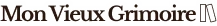

<a name="readme-top"></a>

<div align="center">
[![Contributors][contributors-shield]][contributors-url]
[![Forks][forks-shield]][forks-url]
[![Stargazers][stars-shield]][stars-url]
[![Issues][issues-shield]][issues-url]
[![MIT License][license-shield]][license-url]
</div>

<!-- PROJECT LOGO -->
<br />
<div align="center">
  <a href="https://github.com/Erik-42/openclassrooms_projet_7.git">
    
  </a>

<h3 align="center">Mon Vieux Grimoire</h3>

  <p align="center">
    Développez le back-end d'un site de notation de livres
    <br />
    <a href="https://github.com/Erik-42/openclassrooms_projet_7.git"><strong>Explore the docs »</strong></a>
    <br />
    <br />
    <a href="https://erik-42.github.io/openclassrooms_projet_7/">View Demo</a>
    ·
    <a href="https://github.com/Erik-42/openclassrooms_projet_7/issues/1">Report Bug</a>
    ·
    <a href="https://github.com/Erik-42/openclassrooms_projet_7/issues/2">Request Feature</a>
  </p>
</div>

<!-- TABLE OF CONTENTS -->
<details>
  <summary>Table of Contents</summary>
  <ol>
    <li>
      <a href="#about-the-project">About The Project</a>
      <ul>
        <li><a href="#built-with">Built With</a></li>
      </ul>
    </li>
    <li>
      <a href="#getting-started">Getting Started</a>
      <ul>
        <li><a href="#prerequisites">Prerequisites</a></li>
        <li><a href="#installation">Installation</a></li>
      </ul>
    </li>
    <li><a href="#usage">Usage</a></li>
    <li><a href="#roadmap">Roadmap</a></li>
    <li><a href="#contributing">Contributing</a></li>
    <li><a href="#license">License</a></li>
    <li><a href="#contact">Contact</a></li>
    <li><a href="#acknowledgments">Acknowledgments</a></li>
  </ol>
</details>

<!-- ABOUT THE PROJECT -->
# OpenClassRooms_Projet_7

Développez le back-end d'un site de notation de livres au nom d'une chaîne de librairies “Le Vieux Grimoire” 

# 

### Built With

* [![Node][Nodejs.org]][Node-url]
* [![Express][Expressjs.com]][Express-url]
* [![JavaScript][Ecma-international.org]][JavaScript-url]
* [![MongoDB][Mongodb.com]][MongoDB-url]

<p align="right">(<a href="#readme-top">back to top</a>)</p>

## Technologies:

- Node.js
- Express
- JavaScript
- MongoDB

## Installation:
1. Clone the repo
   ```sh
   git clone https://github.com/Erik-42/openclassrooms_projet_7.git
   ```
2. Install `Npm` packages
   ```sh
   npm install

ou

2. Install `Yarn` packages
   ```sh
   yarn add
   ```

3. Install `Nodemon`
   ```sh
   yarn add nodemon --save
   ```

4. Lancement backend Node
   ```sh
   nodemon server
   ```

5. Lancement frontend `Npm`
   ```sh
   npm start
   ```
ou

5. Lancement frontend `Yarn`
   ```sh
   yarn start
   ```
   
<p align="right">(<a href="#readme-top">back to top</a>)</p>


## Testez le projet:

https://erik-42.github.io/openclassrooms_projet_7/

Formation OpenClassRoom developpeur web


<!-- CONTRIBUTING -->
## Contributing

Contributions are what make the open source community such an amazing place to learn, inspire, and create. Any contributions you make are **greatly appreciated**.

If you have a suggestion that would make this better, please fork the repo and create a pull request. You can also simply open an issue with the tag "enhancement".
Don't forget to give the project a star! Thanks again!

1. Fork the Project
2. Create your Feature Branch (`git checkout -b feature/AmazingFeature`)
3. Commit your Changes (`git commit -m 'Add some AmazingFeature'`)
4. Push to the Branch (`git push origin feature/AmazingFeature`)
5. Open a Pull Request

<p align="right">(<a href="#readme-top">back to top</a>)</p>


<!-- LICENSE -->
## License

Distributed under the MIT License. See `LICENSE.txt` for more information.

<p align="right">(<a href="#readme-top">back to top</a>)</p>

<!-- CONTACT -->
## Contact

Erik-42 - [Erik_42](https://discord.com/)

Project Link: [https://erik-42.github.io/openclassrooms_projet_7/](https://erik-42.github.io/openclassrooms_projet_7/)

[![LinkedIn][linkedin-shield]][linkedin-url]

<p align="right">(<a href="#readme-top">back to top</a>)</p>

<!-- MARKDOWN LINKS & IMAGES -->
<!-- https://www.markdownguide.org/basic-syntax/#reference-style-links -->
[contributors-shield]: https://img.shields.io/github/contributors/Erik-42/openclassrooms_projet_7
[contributors-url]: https://github.com/Erik-42/openclassrooms_projet_7/graphs/contributors
[forks-shield]: https://img.shields.io/github/forks/Erik-42/openclassrooms_projet_7
[forks-url]: https://github.com/Erik-42/openclassrooms_projet_7/network/members
[stars-shield]: https://img.shields.io/github/stars/Erik-42/openclassrooms_projet_7
[stars-url]: https://github.com/Erik-42/openclassrooms_projet_7/stargazers
[issues-shield]: https://img.shields.io/github/issues-raw/Erik-42/openclassrooms_projet_7
[issues-url]: https://github.com/Erik-42/openclassrooms_projet_7/issues
[license-shield]: https://img.shields.io/github/license/Erik-42/openclassrooms_projet_7
[license-url]: https://github.com/Erik-42/openclassrooms_projet_7/blob/master/LICENSE.txt
[linkedin-shield]: https://img.shields.io/badge/-LinkedIn-black.svg?style=for-the-badge&logo=linkedin&colorB=555
[linkedin-url]: https://www.linkedin.com/in/erik-mesen-3469b71a1/
[product-screenshot]: ./frontend/src/images/screenshot.png
[Node-url]: https://nodejs.org/
[Express-url]: http://expressjs.com/
[MongoDB-url]: https://www.mongodb.com/
[JavaScript-url]: https://www.ecma-international.org/publications-and-standards/standards/ecma-262/
